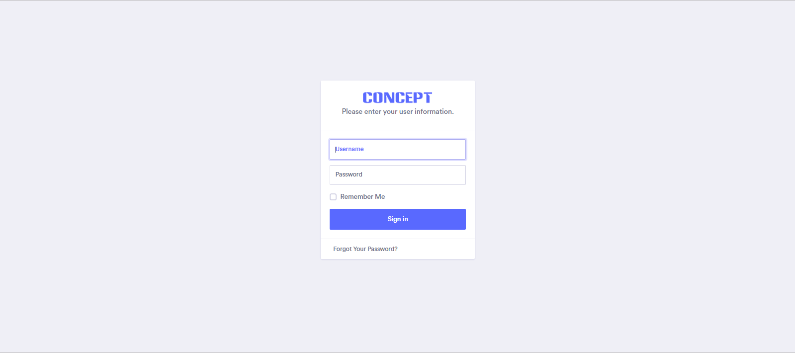
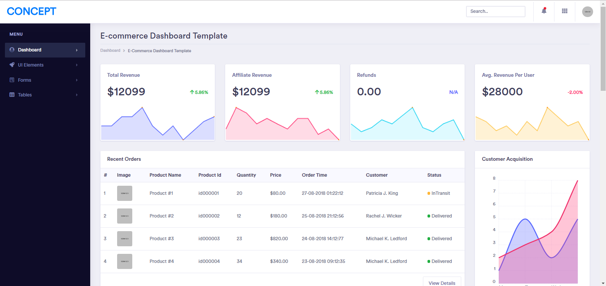

<h1>Instructions</h1>
	
1)update the composer 2)Change the .env.example to ".env" 3)Change the database credetials in the .env file 4)Import the ladmin.sql to your database

	
Note: I have removed the public folder from the url.

<h1>Screen Shots<h1>
	
Login Screen

	
	
Dashboard

	

<h1>Login Credentials</h1>
	
User:admin@laravel.com
 
	
Pass:123123

